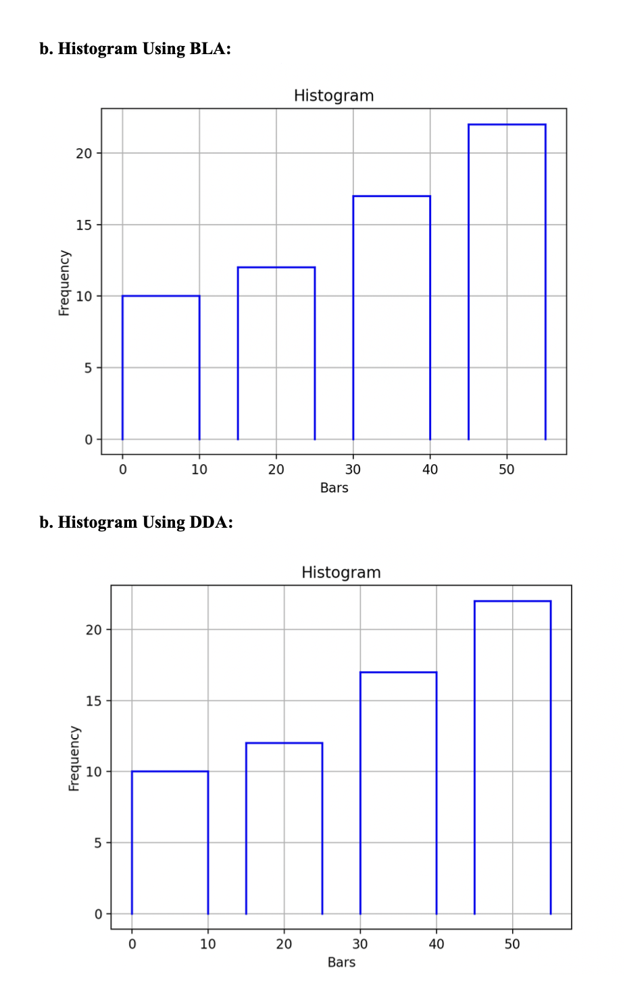
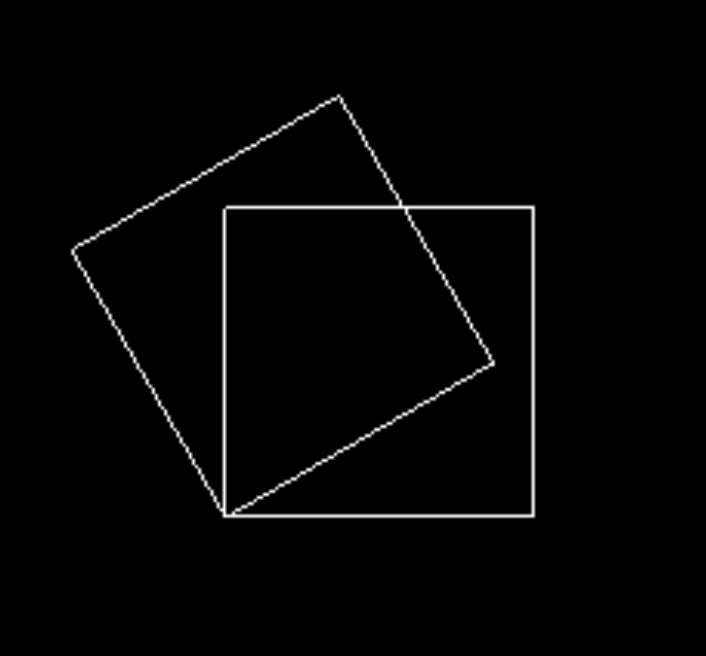

# Computer-Graphics

# Lab 1
This lab work focuses on utilizing C++, the openFrameworks library, and OpenGL to create a visual representation of the Nepal Tourism Board (NTB) logo. The project aims to demonstrate fundamental graphics rendering techniques, including geometric manipulation within the openFrameworks environment. By leveraging these tools, the objective of this lab work is to recreate the NTB logo.

## Setup and Initialization
I began by setting up the development environment using the openFrameworks library. I have encapsulated the application logic within the ofApp class to organize the code effectively. The `ofSetupOpenGL` function was utilized to initialize the application window, which was configured to a resolution of 1024x1024 pixels. I have used the OpenGL Library and integrated it within the openFrameworks framework.

## Output

## Conclusion
In conclusion, this lab session provided valuable insights into graphics programming using C++ and openFrameworks. By leveraging OpenGL's capabilities and the openFrameworks framework, a visually appealing representation of Nepal Tourism Board's logo was successfully created. The project underscored the importance of understanding fundamental graphics concepts and utilizing appropriate libraries and tools for efficient development.

# Lab 2
This Lab implements Digital Differential Analyzer Line drawing algorithm, Bresenham Line Drawing algorithm [for both slopes(|m|<1 and |m|>=1)] and implements the given line drawing algorithm to draw a line histogram  for any given frequency inputs. 

## Output
### Line Drawing Algorithms

# Lab 3

* A Program to implement mid- point Circle Drawing Algorithm
* A Program to implement mid- point Ellipse Drawing Algorithm

## Output

### Circle

### Ellipse

# Lab 4

A Program to implement:
* 2D Translation
* 2D Rotation
* 2D Scaling
* 2D Reflection
* 2D Shearing
* Composite Transformation

## Output
### Rotation

### Scaling and Translation

### X-axis Shearing

### Y-axis Shearing

# Lab 5

* Implemented Liang Barsky Line Clipping algorithm
* Implemented Sutherland Hodgemann polygon clipping algorithm

## Output

### Polygon Clipping

### Line Clipping

# Lab 6

## Implemented the following 3D transformations using the 3D shapes provided by Opengl:
* Translation
* Rotation
* Shearing
* Scaling

## Implemented the Perspective Projection

## Output

